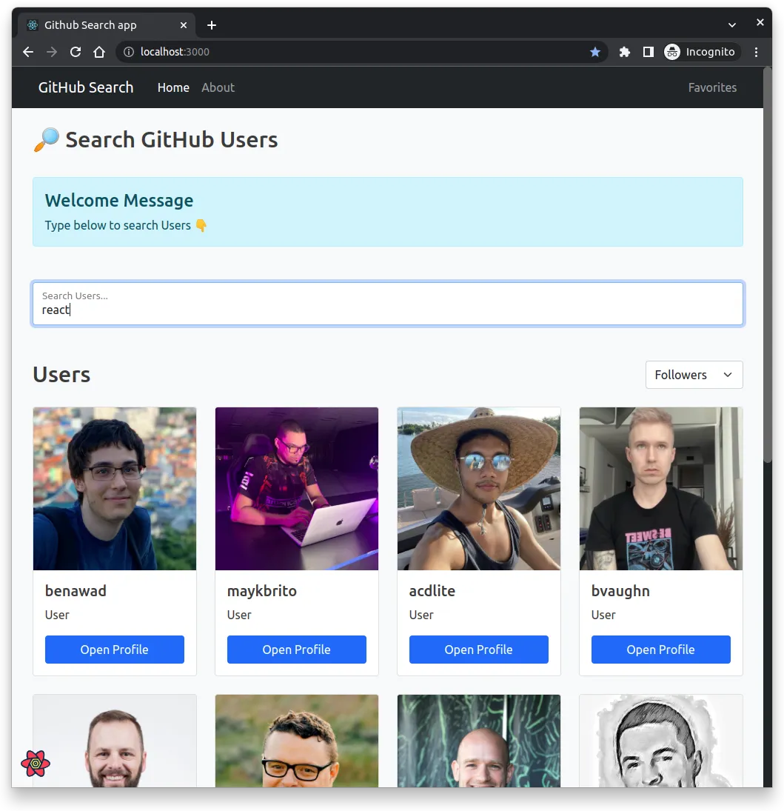
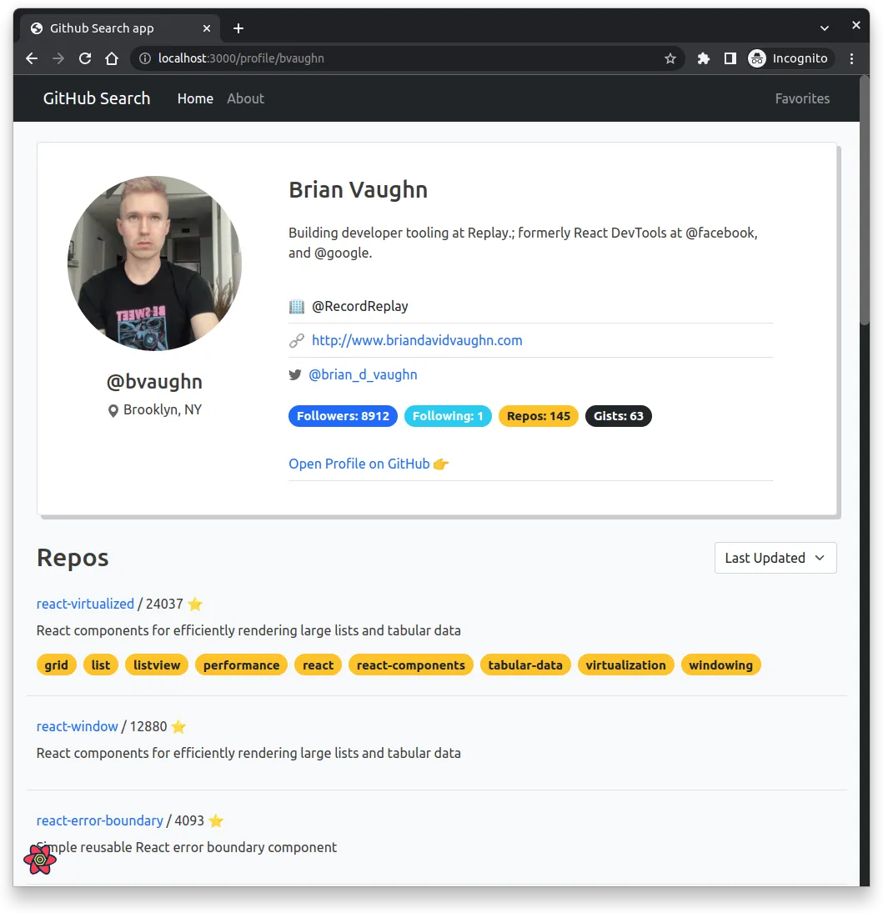
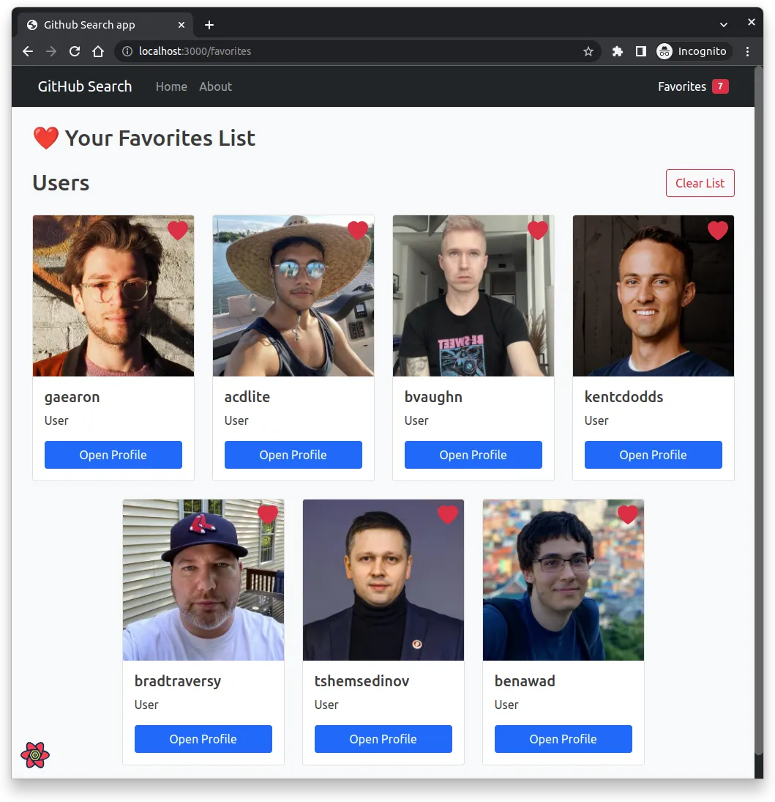

# React-github-search-app

> training project

## Preview

## Tech Stack & main tools

- TypeScript
- React, Hooks, Context
- React-Router
- React-Bootstrap
- animations (React Transition Group)
- React-Query (🔥 Amazing tool)
- axios
- lodash
- GitHub API

## Features

- User Search
- Sort Filters (user, repos)
- User Profile routing
- User's Favorite List

## ToDo

- [x] add TypeScript
- [x] add User's Favorite List
