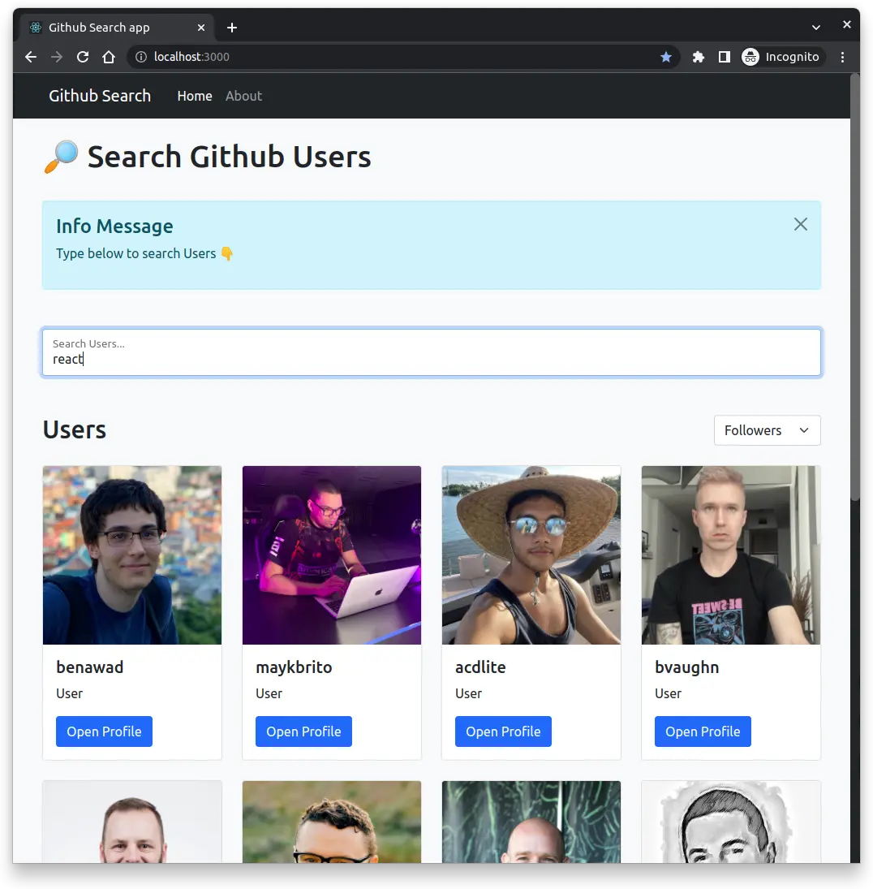
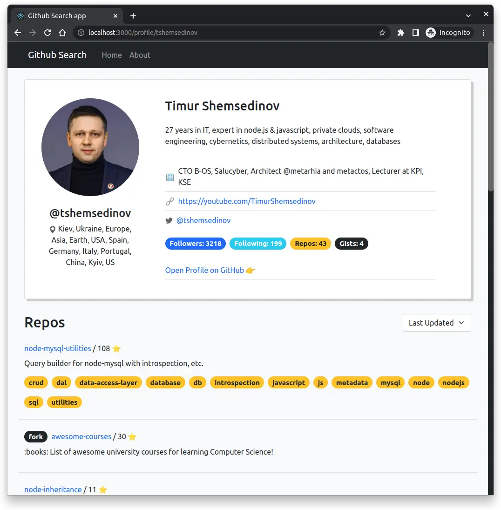

# React-github-search-app

> training project

## Preview

## Tech Stack & main tools

- React, Hooks
- React-Router
- React-Bootstrap
- animations (React Transition Group)
- React Query
- axios
- lodash (debounce)
- GitHub API

## Features

- User Search
- Sort Filters (user, repos)
- User Profile routing
- Responsive layout

## Todo

- [ ] add TypeScript
- [ ] add User's Favorite List
